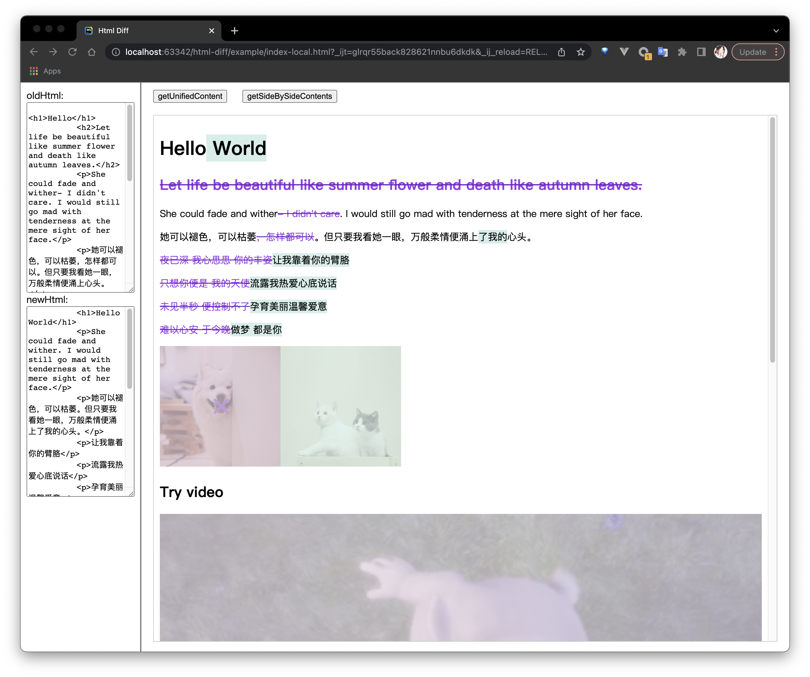
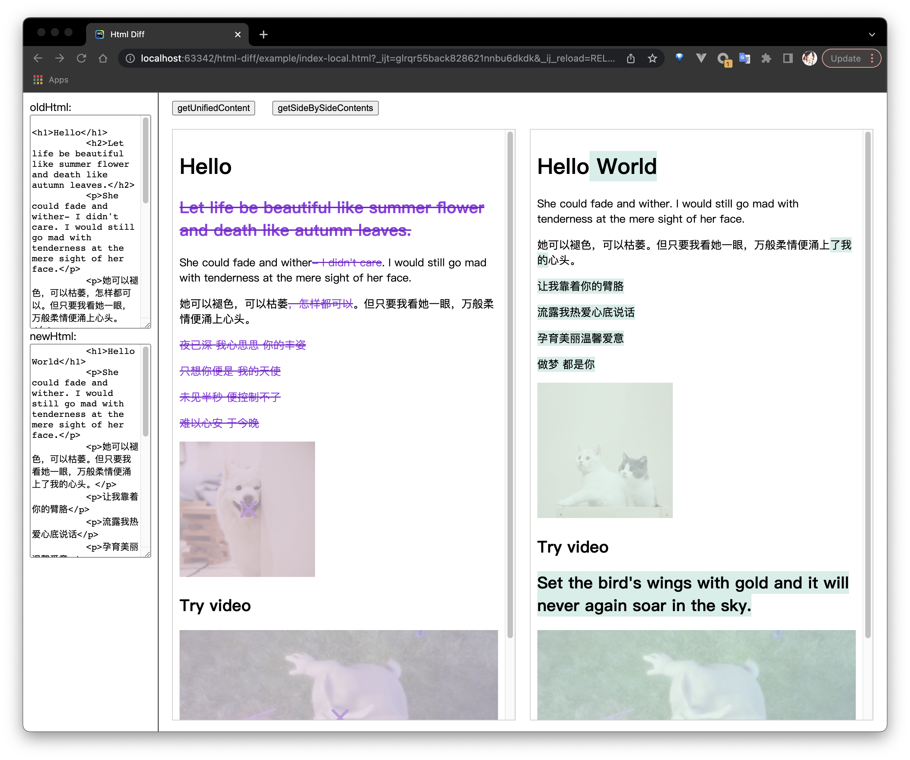

# Html Diff

Generate html content unified or side-by-side differences.

## INSTALL

```
pnpm add @armantang/html-diff
```

## QUICK START

```js
import '@armantang/html-diff/dist/index.css'
import HtmlDiff from '@armantang/html-diff'

const oldHtml = `<div>hello</div>`
const newHtml = `<div>hello world</div>`

const diff = new HtmlDiff(oldHtml, newHtml)
const unifiedContent = diff.getUnifiedContent()
const sideBySideContents = diff.getSideBySideContents()
```

## PREVIEW

### unified differences



### side-by-side differences



